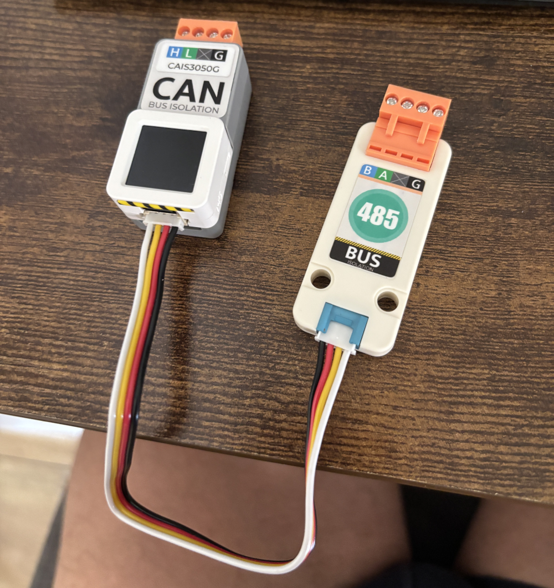

# YamBMS - JK-PB BMS RS485 Solution

[](https://www.gnu.org/licenses/gpl-3.0)
[](https://github.com/Sleeper85/esphome-yambms/releases/latest)


## External component

[JK_RS485](https://github.com/txubelaxu/esphome-jk-bms/blob/main/components/jk_rs485_bms/README.md) by [@txubelaxu](https://github.com/txubelaxu)

## Hardware

> [!TIP]
> This solution only requires an ESP32 with a CAN transceiver and a RS485 transceiver.

You are free to choose the hardware you want, the list below are 3 easy to use examples :

- `AtomS3` with the isolated `Atomic CAN base` and `RS485 unit`
- [`LilyGo T-Connect`, ESP32-S3 with 3x RS485 and 1x CAN](https://github.com/Xinyuan-LilyGO/T-Connect)
- [`LilyGo T-CAN485`, ESP32 with 1x RS485 and 1x CAN](https://github.com/Xinyuan-LilyGO/T-CAN485)

See the [documentation about supported hardware](Supported_devices.md).

### M5Stack AtomS3 example (no welding)

The example below uses an `AtomS3` (display) with the `Atomic CAN base` and `RS485 unit`.



## Schematic and setup instructions

> [!CAUTION]
> Galvanic isolation of the `RS485` connection is strongly recommended.
> The diagrams below does not show the galvanic isolation of the `RS485` connection !

**Note:** the choice of RS485 board is not related to the chosen ESP32.

### AtomS3 with unisolated RS485 board

```
┌──────────┐                 ┌───────────┐                       ┌──────────┐
│          │                 │   UART    │<-VCC--------------5V--│          │<---5V
│   BMS    │                 │    TO     │                       │   ESP32  │
│  JK-PB   │<-RJ45-P1-----B->│   RS485   │<-DI-----------TX--G1--│  Atom S3 │
│          │<-RJ45-P2-----A->│           │--RO-----------RX--G2->│          │                  ┌────────────┐             ┌────────────┐
│  RS485   │                 │ CONVERTER │<-DE--+                │          │--G5--TX-----CTX->|            |             |            |
│ NETWORK  │                 │           │<-RE--└--TALK PIN--G8--│          │<-G6--RX-----CRX--|   Atomic   |<---CAN H--->|  Inverter  |
│          │                 │           │                       │          │<-------5V------->|  CAN Base  |<---CAN L--->|            |
|          |<-RJ45-P3---GND->|           |<-GND-------------GND->|          |<-------GND------>|            |             |            |
└──────────┘                 └───────────┘                       └──────────┘                  └────────────┘             └────────────┘
```

### ESP32-S3 with isolated RS485 board

```
┌──────────┐                 ┌───────────┐                       ┌──────────┐
│          │                 │   UART    │<-V1--------3V3 or 5V--│          │<---5V
│   BMS    │                 │    TO     │                       │          │
│  JK-PB   │<-RJ45-P1-----B->│   RS485   │<-RX-----------TX--17--│ ESP32-S3 │
│          │<-RJ45-P2 ----A->│           │--TX-----------RX--18->│          │                  ┌────────────┐             ┌────────────┐
│  RS485   │                 │ CONVERTER │                       │          │--38--TX-----CTX->|            |             |            |
│ NETWORK  │                 │           │      No TALK PIN (8)--│          │<-39--RX-----CRX--|    CAN     |<---CAN H--->|  Inverter  |
│          │                 │           │                       │          │<-------3V3------>| SN65HVD230 |<---CAN L--->|            |
|          |<-RJ45-P3----G2->|           |<-G1--------------GND->|          |<-------GND------>|            |             |            |
└──────────┘                 └───────────┘                       └──────────┘                  └────────────┘             └────────────┘
```

- [RJ45 568A pinout](../../images/RJ45-Pinout-T568A.jpg)
- [RJ45 568B pinout](../../images/RJ45-Pinout-T568B.jpg)

## BMS DIP switch config (mode 2)

With mode 2, the sniffer (ESP32) will automatically take the address 0x00 and act as master BMS (max 15 BMS).

- BMS 1 RS485 address : 0x01
- BMS 2 RS485 address : 0x02
- BMS 3 RS485 address : 0x03
- etc.

## JK-PB RS485 functions

### Sniffer Broadcast changes to all BMS


When enabled, this function synchronizes the settings of all your BMS connected to the same RS485 network as soon as you make parameter changes.
